# Hardware_Practice
Repo to store modules from practicing Verilog/System Verilog 

## Problems
Problem sets are found on HDL bits and the simulations are carried out on EDA Playground.
Electronic Design Automation Playground is an online platform that provides a web-based environment for writing, running, and sharing HDL.
This also includes a Code Editor which provides a place for writing HDL code; 
Simulation Tools which allows to run simulations similar to tools such as ModelSim, VCS, Icarus Verilog, and more;
Libraries which offers a collection of libraries that can be used as reference.

### Problem #21: Thermostat Waveform Results
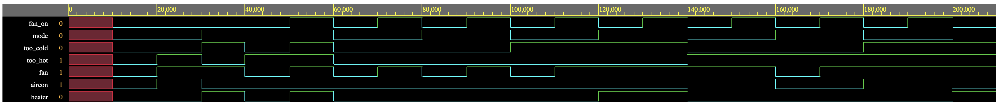
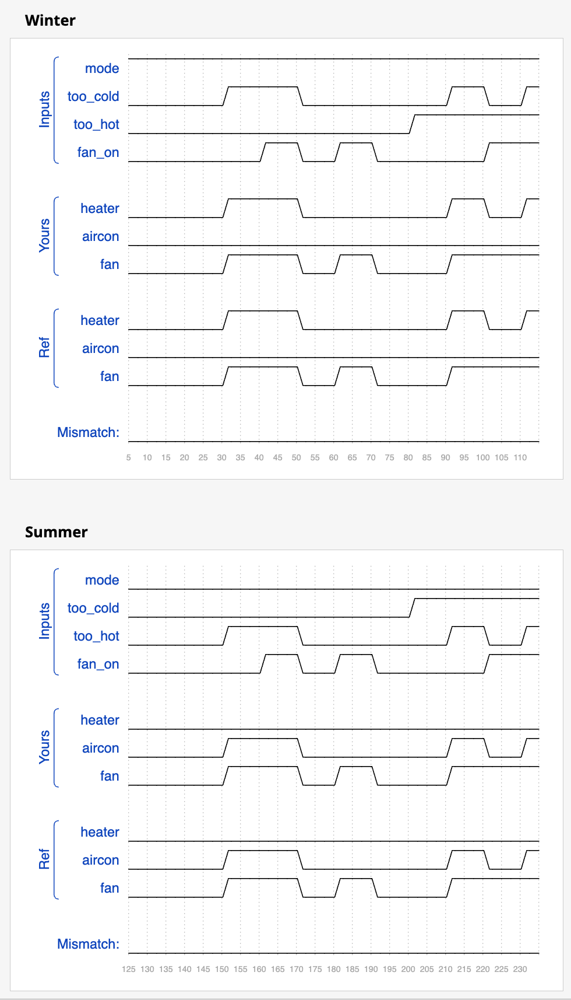

### Problem #20: 8 D Flip Flops with Active High Synchronous Reset Waveform Results
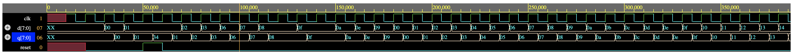
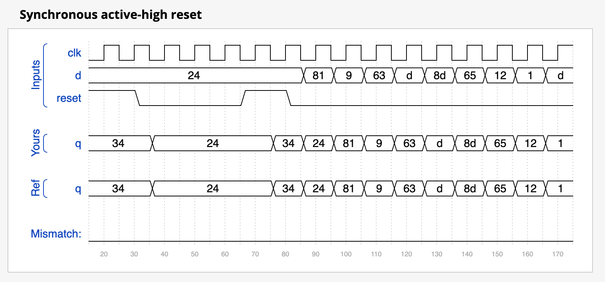

### Problem #19: 32 Bit Adder and Subtractor with XOR Waveform Results
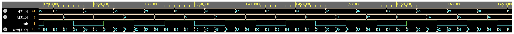
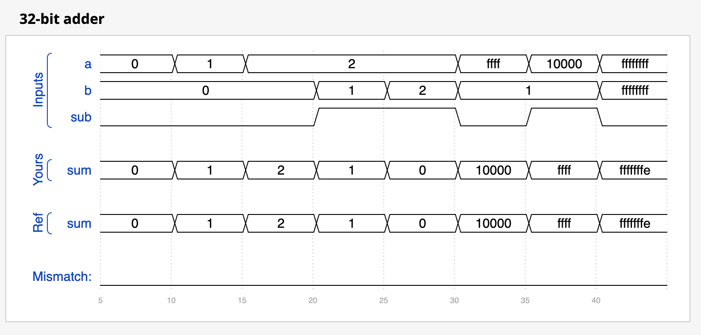

### Problem #18: Minimum Using Ternary Conditional Operator Waveform Results
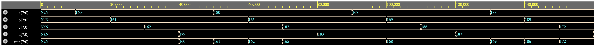
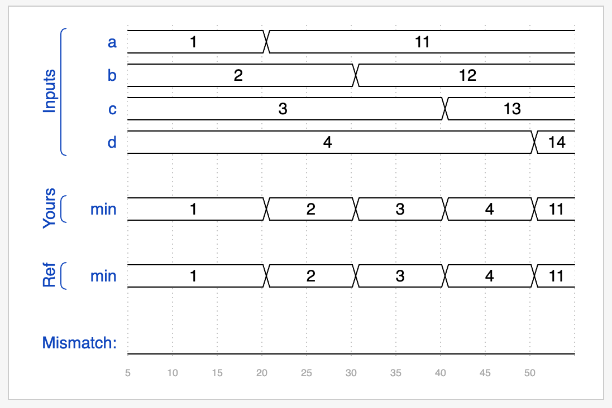

### Problem #17: Replication XOR Waveform Results
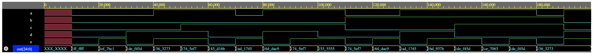

### Problem #16: 4 Bit Shift Register Waveform Results
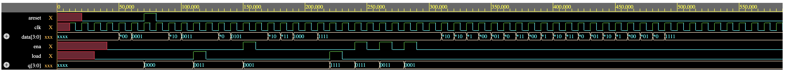
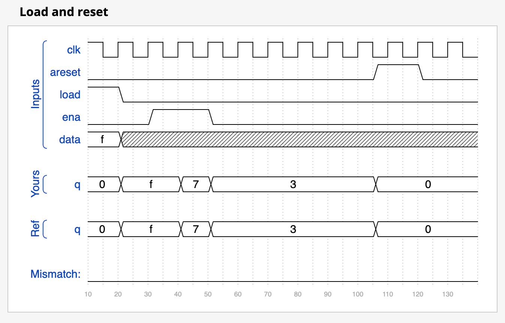

### Problem #15: 32 Bit Carry Select Adder Waveform Results
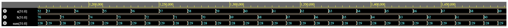
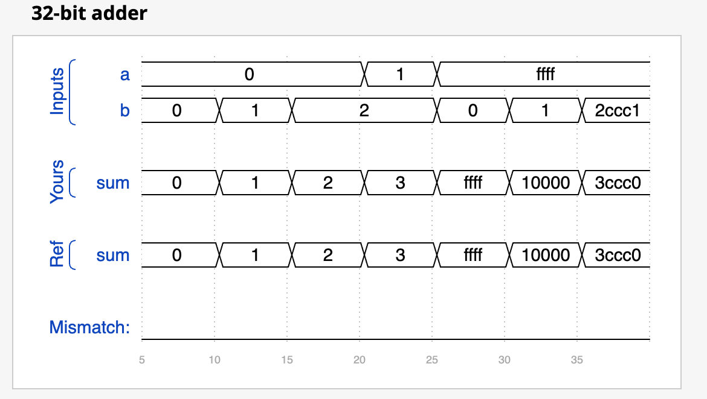

### Problem #14: 100 Bit Ripple Carry Adder Waveform Results
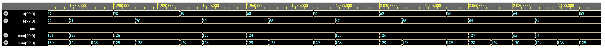

### Problem #13: 256 to 1 Mux Waveform Results
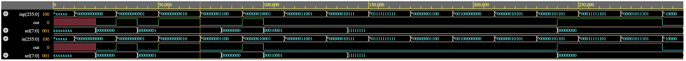

### Problem #12: Vector Reversal with Combinational For Loop Waveform Results
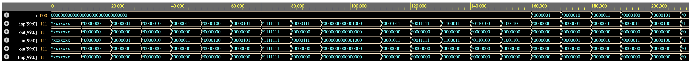

### Problem #11: Combinational For Loop Waveform Results
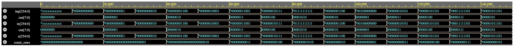
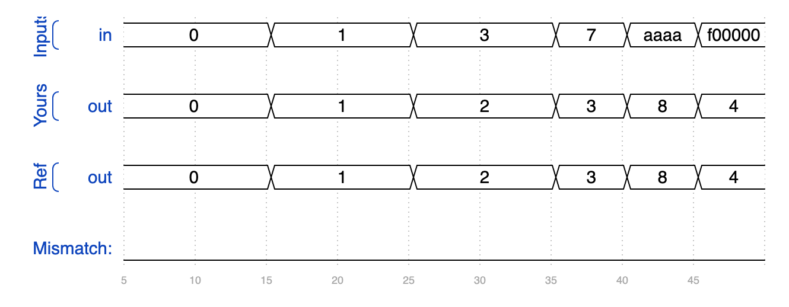

### Problem #10: 7458 Chip Waveform Results
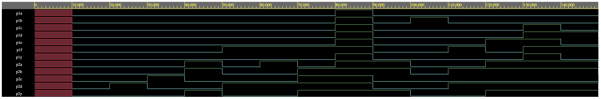
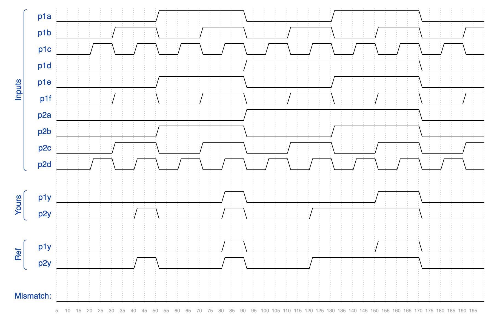

### Problem #9: Vector Concatenation Waveform Results
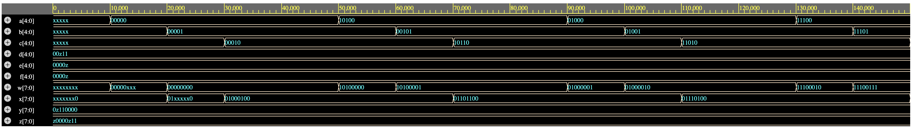
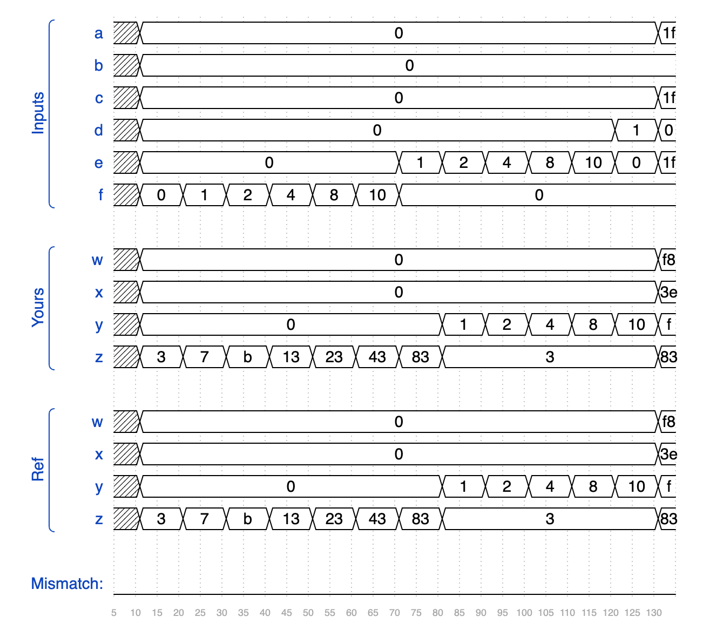

### Problem #8: Reverse Vector with For Loop Results
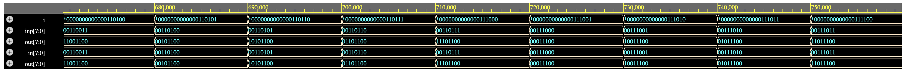
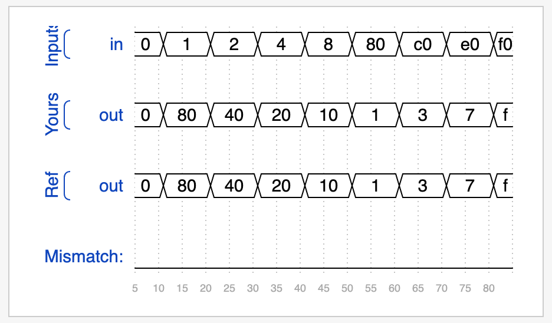

### Problem #7: Priority Encoder Waveform Results
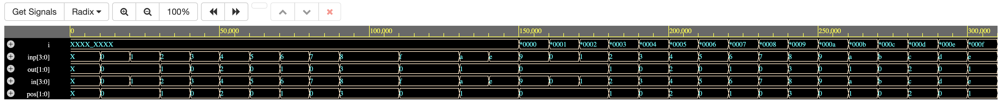
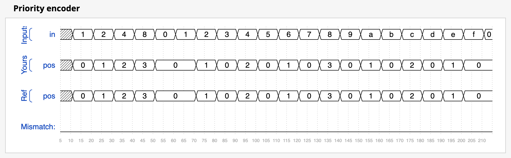

### Problem #6: Difference between Bitwise and Logical Operators Analysis Results

### Problem #5: Always Construct Analysis Results

### Problem #4: Concatenation & Replication Waveform Result

### Problem #3: Vectors Waveform Result

### Problem #2: XNOR Waveform Result

### Problem #1: Simple Wire Waveform Result

