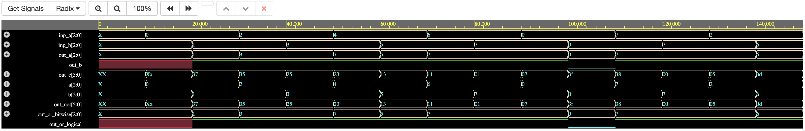
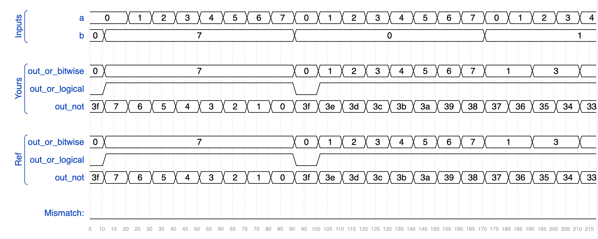
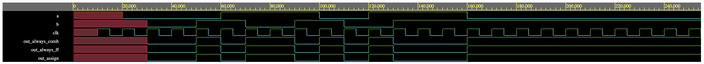
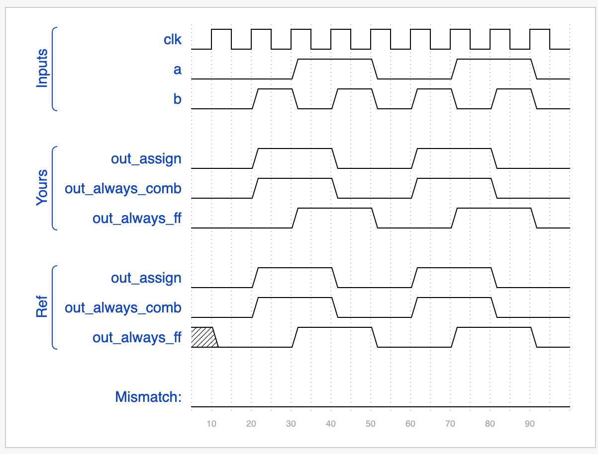
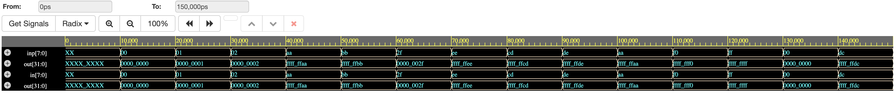
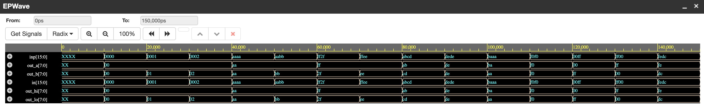
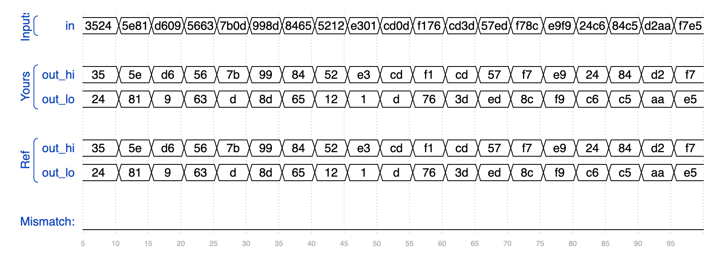
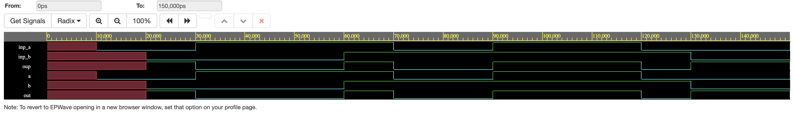
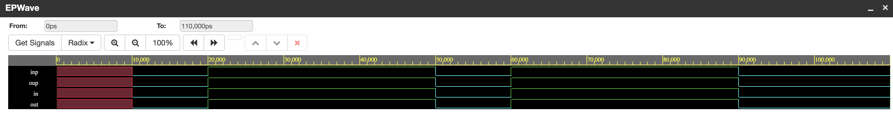

# Hardware_Practice
Repo to store modules from practicing Verilog/System Verilog 

## Problems
Problem sets are found on HDL bits and the simulations are carried out on EDA Playground.
Electronic Design Automation Playground is an online platform that provides a web-based environment for writing, running, and sharing HDL.
This also includes a Code Editor which provides a place for writing HDL code; 
Simulation Tools which allows to run simulations similar to tools such as ModelSim, VCS, Icarus Verilog, and more;
Libraries which offers a collection of libraries that can be used as reference.

### Problem #6: Difference between Bitwise and Logical Operators Analysis Results

### Problem #5: Always Construct Analysis Results

### Problem #4: Concatenation & Replication Waveform Result

### Problem #3: Vectors Waveform Result

### Problem #2: XNOR Waveform Result

### Problem #1: Simple Wire Waveform Result

